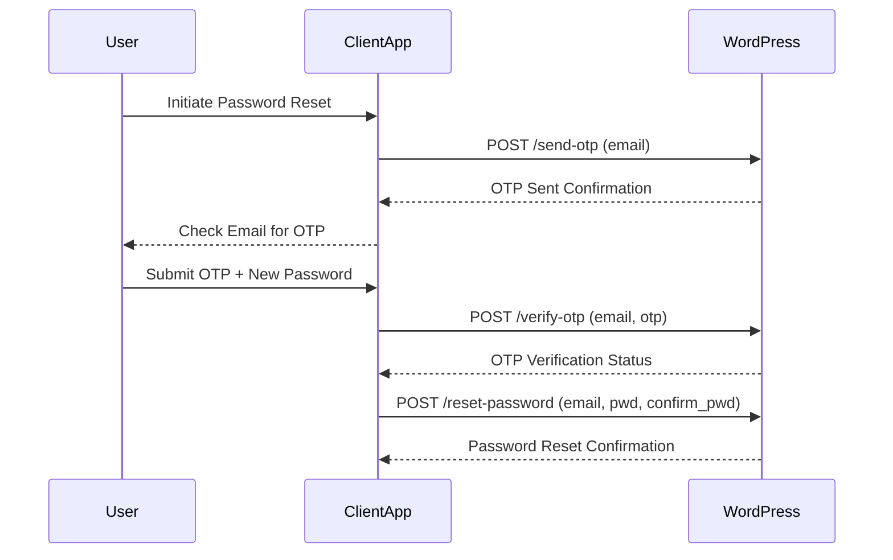
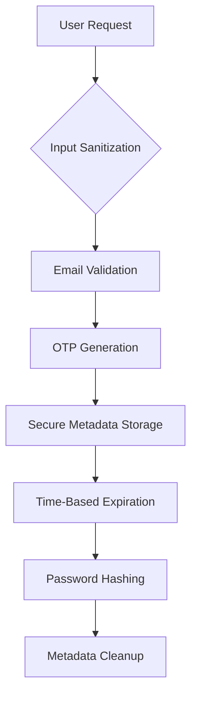

# Secure OTP-Based Password Reset System for WordPress


A robust password reset solution implementing military-grade security practices through custom REST API endpoints and time-limited OTP verification.

---

## Technical Overview

### System Flow


### Core Components
```
app-expert-password-reset/
├── app-expert-password-reset.php             # Main plugin file (entry point)
├── includes/                                 # Contains core functionality files
│   ├── class-reset-password-api.php          # Handles API endpoints (send OTP, verify OTP, reset password)
│   ├── indexr.php                            # Bootstrap or helper file (if needed)
│   └── general/                              # General utility functions
│       └── class-utility.php                 # Utility/helper functions for the plugin
└── config.php                                # Configuration file (e.g., constants, settings)                                
```

---

## Technical Specifications

### API Endpoint Matrix

| Endpoint               | Method | Parameters                      | Success Response          | Error Codes               |
|------------------------|--------|---------------------------------|---------------------------|--------------------------|
| `/send-otp`            | POST   | `email` (string)               | 200: OTP sent             | 404: Email not found     |
| `/verify-otp`          | POST   | `email` (string), `otp` (int)  | 200: OTP verified         | 400: Invalid/Expired OTP |
| `/reset-password`       | POST   | `email` (string), `password` (string), `confirm_password` (string) | 200: Password updated | 400: Validation failed |

---

## Security Implementation



---

## Installation & Configuration

### Requirements
- WordPress ≥5.8 (REST API support)
- PHP ≥7.4 with OpenSSL extension
- SMTP server configured for email delivery

### Installation
```bash
# Clone repository into plugins directory
cd wp-content/plugins/
git clone https://github.com/yourrepo/app-expert-password-reset.git
```

### Configuration
1. Set environment variables in `config.php`:
```php
define('OTP_EXPIRATION', 600);  // 10 minutes in seconds
define('OTP_LENGTH', 6);        // 6-digit code
define('MAX_ATTEMPTS', 3);      // Maximum verification attempts
```

---

## Database Schema

### User Meta Structure
| Meta Key                    | Data Type | Description                                 |
|-----------------------------|-----------|---------------------------------------------|
| `appExpert_otp`             | INT(6)    | Generated OTP code                          |
| `appExpert_otp_expires`     | TIMESTAMP | OTP expiration time                         |
| `appExpert_otp_verified`    | BOOLEAN   | OTP verification status                     |
| `appExpert_otp_attempts`    | INT       | Number of failed verification attempts      |
| `appExpert_otp_last_attempt`| TIMESTAMP | Timestamp of last OTP verification attempt  |

**Meta Cleanup Process**:
```php
delete_user_meta($user_id, 'appExpert_otp');
delete_user_meta($user_id, 'appExpert_otp_expires');
delete_user_meta($user_id, 'appExpert_otp_verified');
delete_user_meta($user_id, 'appExpert_otp_attempts');
delete_user_meta($user_id, 'appExpert_otp_last_attempt');

```
---

## Error Handling Matrix

| Error Code | Scenario                  | Resolution Path                     |
|------------|---------------------------|-------------------------------------|
| 400        | Invalid OTP               | Retry verification flow            |
| 401        | Unauthorized access       | Validate API credentials           |
| 404        | User not found            | Verify email registration          |
| 429        | Rate limit exceeded       | Implement exponential backoff      |
| 500        | Internal server error     | Check server logs & diagnostics    |

